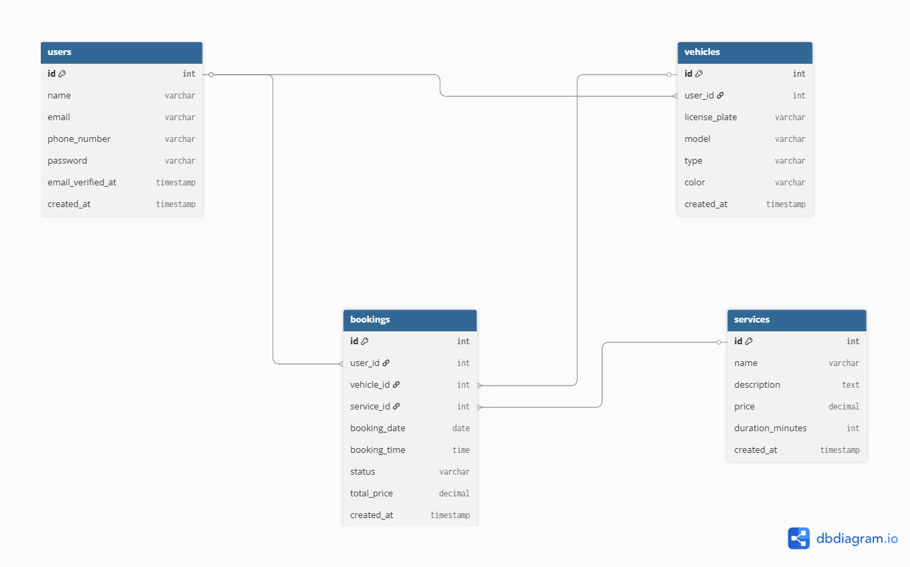

# Car Wash Booking Website

Aplikasi web Laravel untuk sistem booking layanan cuci mobil secara online. Pengguna dapat mendaftarkan kendaraan mereka, memilih layanan yang tersedia, dan melakukan booking dengan mudah.

## Fitur Utama

- **Manajemen Pengguna**: Registrasi dan login pengguna.
- **Manajemen Kendaraan**: Pengguna dapat menambahkan dan mengelola kendaraan mereka (plat nomor, model, tipe, warna).
- **Layanan**: Daftar layanan cuci mobil yang tersedia dengan harga dan durasi.
- **Booking**: Sistem booking untuk memesan layanan cuci mobil, termasuk pemilihan tanggal, waktu, dan status booking.
- **Soft Deletes**: Semua model menggunakan soft deletes untuk data recovery.

## Model dan Relasi

### User
- Relasi: `hasMany(Vehicle)`, `hasMany(Booking)`
- Atribut: name, email, phone_number, password  

### Vehicle
- Relasi: `belongsTo(User)`, `hasMany(Booking)`
- Atribut: user_id, licence_plate, model, type, color

### Service
- Relasi: `hasMany(Booking)`
- Atribut: name, description, price, duration_minutes

### Booking
- Relasi: `belongsTo(User)`, `belongsTo(Vehicle)`, `belongsTo(Service)`
- Atribut: user_id, vehicle_id, service_id, booking_date, booking_time, status, total_price

## ERD

Diagram Entity-Relationship (ERD) di bawah ini menggambarkan struktur database dan relasi antar entitas dalam sistem Car Wash Booking. User dapat memiliki banyak Vehicle dan Booking, Vehicle dapat memiliki banyak Booking, Service dapat memiliki banyak Booking, sedangkan Booking terkait dengan satu User, satu Vehicle, dan satu Service.



## Instalasi

1. Clone repository ini:
   ```bash
   git clone https://github.com/Orin10120/simple_model_car_wash_booking_website.git
   cd challenge-project
   ```

2. Install dependencies:
   ```bash
   composer install
   ```

3. Setup environment:
   - Copy `.env.example` ke `.env`
   - Konfigurasi database di `.env`

4. Jalankan migrasi:
   ```bash
   php artisan migrate
   ```


